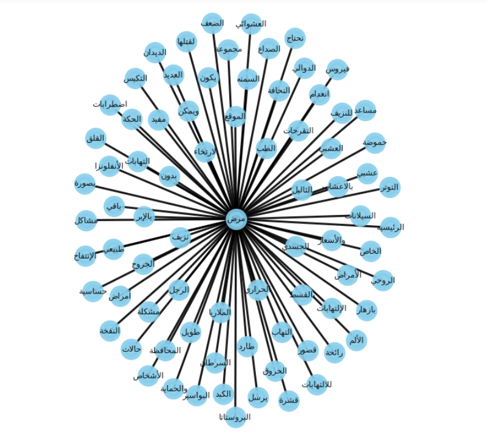
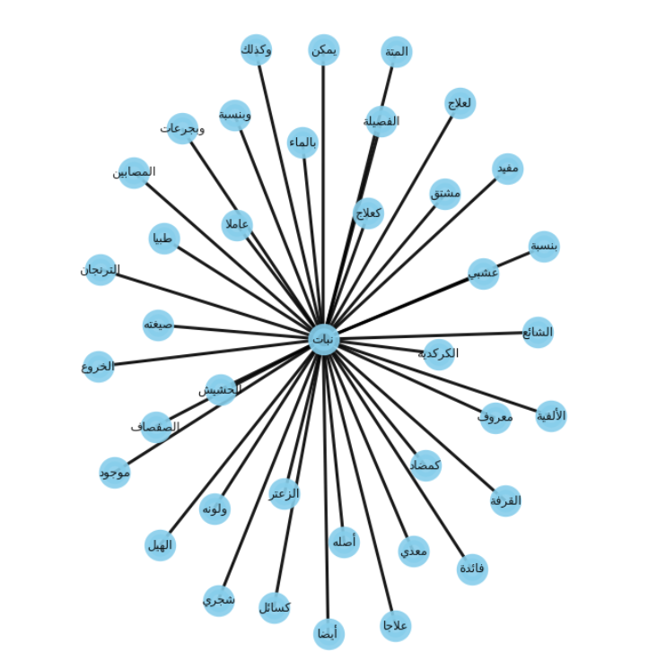

# Arabic Medical Ontology
This project aims to apply NLP techniques to process Arabic natural language text. It includes dataset preprocessing, tokenization, stop words and punctuation removal, and regular expression to extract semantic relations, which is a solution towards building an Arabic Ontology.

## Table of Contents
* [Introduction](#introduction)
* [Dataset](#dataset)
* [Relation Extraction](#relation-extraction)
* [Knowledge Graph](#knowledge-graph)

## Introduction
Ontology can be seen as a pattern of how a given concept is designed to be correlated with other concepts in a given context. In recent years, the field of ontology learning from text has attracted a lot of attention, resulting in a wide variety of approaches to the extraction of knowledge from textual data. Yet, results so far are still limited for arabic language. It is still a very challenging task in Arabic and little resources are available.

## Dataset
The [dataset](https://github.com/DanaKailani/Arabic_Med_Ontology/tree/main/Dataset/medHerb) used is arabic medical articles scraped from “http://www.arabaltmed.com/” and cleaned. It contains articles as text files including information about diseases, treatment, and herbs. Only 74 rows were imported – for the sake of project simplicity - and read as a dataframe with one column ‘Body’.

## Relation Extraction
The approach used in this project was shallow NLP analysis, which included Regular Expression (RE). Usually Ontology Learning or Relation Extraction tasks also use NER (Named Entity Recognition) to extract entities but Arabic tools either required a huge computing power or just didn’t give accurate results enough to build a simple tree. Hence, the only eligible and also very common approach to relation extraction is using “Regular Expression” only to extract “is-a” entities and build graphs.
```
match_string =[]
for sent in text:
    cond = re.findall('علاج\s*(\S+)', sent)
    if cond:
        match_string.append(cond)

string = []
for sublist in match_string:
    for val in sublist:
        string.append(val)
        

diseases = []
for word in string:
    if word not in ar_stop_words and len(word)>=4:
        diseases.append(word)
```
Here, every word after the word “علاج” was extracted and assigned the results as diseases. And so we did the same thing for “نبات” as herbs. In other words, we created tuples with 2 elements, one being the disease/herb term and the other is the actual value of the diseases and herbs. Like so:
```
[("مرض", "الديدان"), ("مرض", "الكبد"), ("مرض", الدوالي")]
[("نبات", "الخروع"), ("نبات", "الكركديه"), ("نبات", القرفة")]
```

## Knowledge Graph
[NetworkX](https://pypi.org/project/networkx/) and [Matplotlib](https://pypi.org/project/matplotlib/) libraries were used to build the Knowledge Graph, but the results were Arabic letters reversed so this problem was handled before building the graph by using [arabic_reshaper](https://pypi.org/project/arabic-reshaper/) and [bidi.algorithm ](https://pypi.org/project/python-bidi/) libraries. Next, we added the nodes and edges to print the appropriate graph.
```  
def printGraph(tuples):
    G = nx.Graph()
    for tup in tuples:
        G.add_node(tup[0])
        G.add_node(tup[1])
        G.add_edge(tup[0], tup[1])
    pos = nx.spring_layout(G)
    plt.figure(figsize=(7, 9))
    nx.draw(G, pos, edge_color='black', width=3, linewidths=9,
            node_size=500, node_color='skyblue', alpha=0.9,
            labels={node: node for node in G.nodes()})
    plt.axis('off')
    plt.show()

```
Finally, we have two trees with "مرض" and "نبات" being the parents and we can see their children.
(Future work would include more data preprocessing to improve accuracy) 
مرض                 |                                         نبات
:------------------------------------------:|:-------------------------:
  |  
